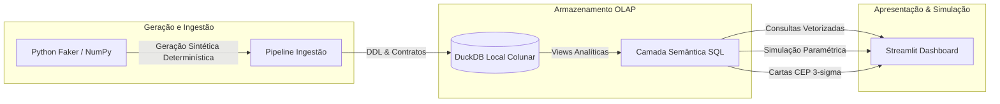

# Arquitetura da Solução e Engenharia de Dados

## 1. Visão Geral da Arquitetura

O projeto adota uma arquitetura colunar desacoplada, leve e orientada a performance analítica local:

---

## 2. Por que DuckDB para Planejamento e Performance?

1. **Latência de Milissegundos:** Processamento colunar vetorizado que agrega milhões de linhas instantaneamente sem necessitar de infraestrutura de servidor dedicada.
2. **SQL Puro e Auditável:** Elimina transformações proprietárias ou dependência excessiva de código imperativo complexo, tornando todas as fórmulas acessíveis e auditáveis por qualquer analista.
3. **Portabilidade:** O banco de dados consiste em um único arquivo local (`data/acolher_analytics.duckdb`), facilitando versionamento, testes e conteinerização via Docker.

---

## 3. Modelo Dimensional: Constelação de Fatos (*Fact Constellation*)

Em vez de um único Star Schema artificial, o negócio é modelado respeitando os diferentes processos que coexistem na organização:
* **Processo 1: Gestão de Carteira e Receita Recorrente** (`fct_contratos`)
* **Processo 2: Atendimentos de Emergência 24h e Sinistros** (`fct_atendimentos`)
* **Processo 3: Pipeline Comercial e Vendas em Loja** (`fct_leads_crm`)

Todos os processos compartilham as **dimensões conformadas**:
* `dim_calendario` (Tempo e competência)
* `dim_unidades` (Filiais físicas e centrais)
* `dim_planos` (Portfólio de produtos)
