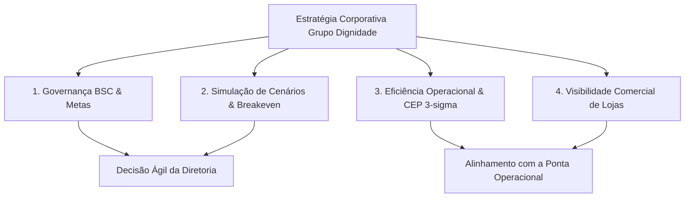

# Planning & Performance Analytics (Projeto Integra-Dignidade)

Bem-vindo à documentação oficial do **Projeto Integra-Dignidade**, a plataforma integrada de governança estratégica, inteligência analítica, simulação paramétrica de cenários e Controle Estatístico de Processo (CEP) desenvolvida para o **Grupo Dignidade**.

---

## 🎯 Propósito e Proposta de Valor

O Grupo Dignidade atua em um mercado com alto volume operacional, capilaridade geográfica e atendimento contínuo 24 horas. Em cenários de expansão territorial e margens competitivas, a gestão não pode depender de consolidações manuais lentas nem de decisões no "feeling".

O **Integra-Dignidade** foi desenhado sob a perspectiva de **Engenharia de Dados aplicada ao Planejamento Estratégico**:
* **Velocidade de Decisão:** Consolidação em menos de 5 segundos via processamento colunar local (DuckDB).
* **Simulação sob Incerteza:** Modelagem dinâmica de sensibilidade (elasticidade de preço, churn, sinistralidade e breakeven).
* **Gestão de Processos (BPM) Conectada à Ponta:** Monitoramento estatístico 3-sigma (CEP) dos atendimentos 24h para identificação de gargalos reais e condução de ritos de melhoria contínua (5 Porquês).
* **Visibilidade Comercial Ágil:** Acompanhamento do funil de captação e dias de estagnação de oportunidades em lojas físicas.

---

## 🏛️ Os Pilares Estratégicos da Solução

---

## 📚 Navegação na Documentação

Explore as seções estruturadas do projeto:
* **[Negócio & Métricas](negocio/contexto_setor.md):** Contexto do setor de assistência familiar e regras de negócio.
* **[Engenharia & Dados](engenharia/arquitetura.md):** Arquitetura colunar desacoplada e modelo de constelação de fatos.
* **[Catálogo de Dados e OKRs](catalogo/glossario_metricas.md):** Fonte única da verdade (*Single Source of Truth*) com definições de tabelas, atributos, siglas e fórmulas.
* **[Padrões de Commit & Git](governanca/padroes_git.md):** Diretrizes de versionamento semântico e rastreabilidade.
* **[Manual de Operação](manual/operacao.md):** Guia prático de inicialização via `uv` e `Docker`.
